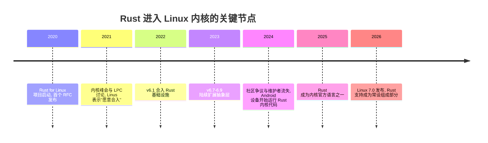

# 引子：内核为什么引入 Rust

Linux 内核是世界上规模最大、协作人数最多的 C 代码库之一，也是被研究得最透彻的攻击面之一。2022 年，v6.1 合入了第一批 Rust 支持——内核在 30 年历史上第一次拥有了第二门官方语言。这不是一次重写，而是一场关于"新代码还能怎么写"的长期实验。

## 从一个数字说起

微软与 Google 各自的安全团队都公布过高度一致的统计：其产品中约 **70% 的安全漏洞本质上是内存安全问题**——use-after-free、缓冲区越界、数据竞争、未初始化内存。内核侧的数据同样如此，而且内核漏洞的代价以亿计。

这些 bug 很少是因为工程师"写得差"。C 的问题在于**类型系统对内存安全不设防**：一个指向已释放内存的指针，在类型系统看来和一个合法指针毫无区别。审查、静态分析、fuzzer 都在事后弥补，而 Rust 的思路是把这类错误变成**编译错误**——所有权与借用检查在编译期就拒绝不安全的内存访问。

一句话概括动机：**不是 C 程序员不够小心，而是 C 让"小心"这件事无法被机器系统地验证。**

## 时间线

## 已经跑起来的代码

"实验"早已进入生产环境：

- **Android Binder**：数百万台 Android 设备的进程间通信核心已经运行 Rust 实现，这是目前部署量最大的内核 Rust 代码。
- **GPU 驱动**：NVIDIA 的 Nova、Apple Silicon 的 AGX 驱动、Arm Mali 的 Rust 实现相继出现——GPU 驱动正是"新写、大块、易出内存错误"的典型场景。
- **驱动与文件系统**：字符设备、平台设备、苹果 Silicon 外设、甚至用 Rust 重写的 EROFS/内核网络部分实验陆续推进。

2026 年，稳定版维护者 Greg Kroah-Hartman 公开表示"Rust 将把 Linux 从 AI 生成的代码缺陷中拯救出来"——当生成式 AI 大量产码时，内存安全语言从"锦上添花"变成了"必需品"。

## 一场还没打完的文化战争

技术之外，这段历史同样值得了解。Rust 入内核的过程伴随着激烈的社区争论：抽象层该由谁维护、C 与 Rust 的接口责任如何划分、子系统维护者是否有义务 review Rust 侧代码。2024 年，一位顶级维护者因反对"Rust 强加的维护负担"而辞职，将矛盾推上台面。

对学习者而言，理解这些争论的意义在于：**内核 Rust 不是"换个语言写驱动"那么简单，而是一套关于安全边界与维护责任的新的社会契约。** 这正是本教程"原理深挖"路线的出发点。

## 这门课讲什么、不讲什么

本教程聚焦**原理**：

- <KernelTerm en="safety abstraction">安全抽象</KernelTerm>如何把 C 的不安全世界包装成 Rust 的安全 API
- `kernel` crate 的结构与设计模式
- pinning 与就地初始化为什么是内核 Rust 最硬核的部分
- 错误处理、内存分配、同步原语与 C 习惯用法的映射
- Kbuild、bindgen 与 unstable 特性的工程现实

不讲什么：Rust 语言基础（建议先过一遍 Rust Book）、C 内核驱动的完整入门（推荐先读 LDD3 的现代替代品或内核文档）、以及任何"如何一夜之间用 Rust 重写子系统"的幻想——Linus 本人反复强调过，Rust 的角色是**新代码的可选项**，而非存量重写。

## 下一步

如果你还没有一个能编译、能启动 Rust 内核代码的环境，先去[快速上手](/quick-start/environment)花一小时把它跑通；如果已经有了，可以直接进入原理篇的第一章：安全抽象的哲学。
