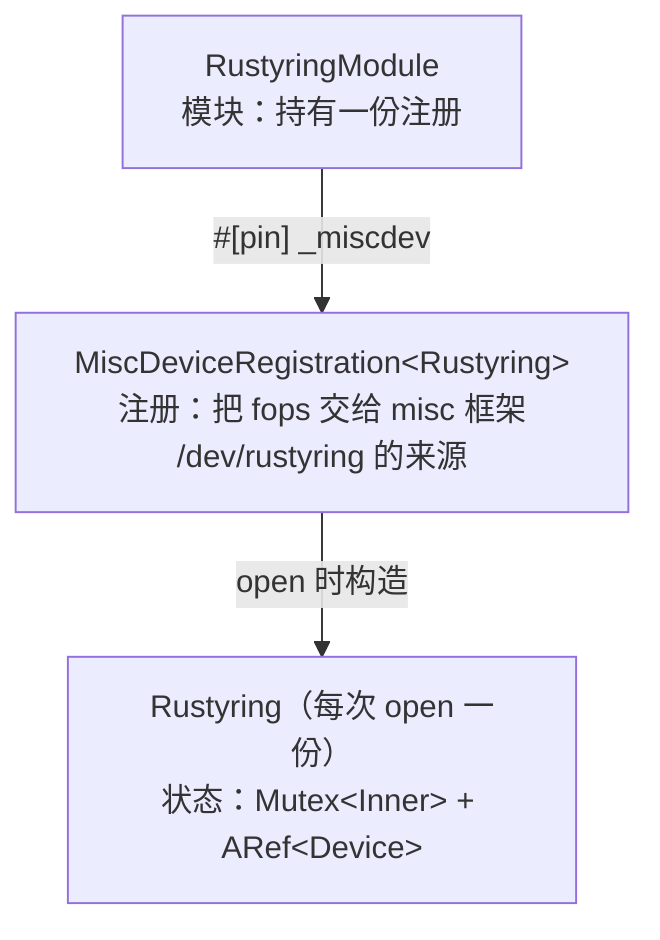

# P3：misc 字符设备

这章让 rustyring 从"会打招呼的模块"变成"能读写的设备"：注册一个 misc 字符设备，实现 `open`/`read_iter`/`write_iter`。先做最朴素的 echo 语义（写什么、读什么），P4 再升级为环形缓冲。**本章的代码形态与官方 `samples/rust/rust_misc_device.rs` 逐段对应**——学完你读那个示例应该毫无障碍。

<VersionBadge label="本文锚定" kernel="master 树" date="2026-10" />

> 对照 [`rust/kernel/miscdevice.rs`](https://github.com/torvalds/linux/blob/master/rust/kernel/miscdevice.rs)与 [`samples/rust/rust_misc_device.rs`](https://github.com/torvalds/linux/blob/master/samples/rust/rust_misc_device.rs)核实（2026-10 检索）。注意文件操作是 `read_iter`/`write_iter`（内核统一的 iter 接口），不是旧资料里的 `read`/`write`——又一个版本锚定点。

## 全景：三层结构

misc 设备驱动的骨架是三层，先建立空间感：



- **模块层**负责"存在"：模块加载时注册，卸载时自动反注册（`MiscDeviceRegistration` 的 `PinnedDrop` 调 `misc_deregister`——又是第 3 章的 Drop 清理）。
- **注册层**负责"被找到"：misc 框架分配次设备号、devtmpfs 生成 `/dev/rustyring` 节点。
- **状态层**负责"被使用"：每次 `open` 构造一份，`Ptr` 通过第 2 章的 `ForeignOwnable` 挂到文件的 private_data 上，随文件关闭销毁。

## 代码：从上到下

### 状态层

```rust
/// 每次 open 独立的设备状态（P3：echo 语义，P4 升级环形）
struct Inner {
    buffer: KVVec<u8>,
}

#[pin_data(PinnedDrop)]
struct Rustyring {
    #[pin]
    inner: Mutex<Inner>,
    dev: ARef<Device>,
}
```

三处都是原理篇的老朋友：`#[pin]` 钉住 `Mutex`（内含 C 锁对象，[第 5 章](/principles/pinning-init)）；`dev` 用 `ARef` 持有设备引用计数（[第 1 章](/principles/safety-philosophy)），日志宏 `dev_info!` 需要它；`PinnedDrop` 让退出有告别日志。

### 文件操作

```rust
#[vtable]
impl MiscDevice for Rustyring {
    type Ptr = Pin<KBox<Self>>;

    fn open(_file: &File, misc: &MiscDeviceRegistration<Self>) -> Result<Pin<KBox<Self>>> {
        let dev = ARef::from(misc.device());
        dev_info!(dev, "rustyring: 打开设备\n");
        KBox::try_pin_init(
            try_pin_init! {
                Rustyring {
                    inner <- new_mutex!(Inner { buffer: KVVec::new() }),
                    dev: dev,
                }
            },
            GFP_KERNEL,
        )
    }

    fn read_iter(mut kiocb: Kiocb<'_, Self::Ptr>, iov: &mut IovIterDest<'_>) -> Result<usize> {
        let me = kiocb.file();               // 拿到本次 open 的状态
        let guard = me.inner.lock();
        let mut pos = kiocb.ki_pos();        // 文件偏移（i64 拷贝）
        let n = iov.simple_read_from_buffer(&mut pos, &guard.buffer)?;
        drop(guard);
        drop(me);                             // 先还借用，才能碰 kiocb 的可变方法
        *kiocb.ki_pos_mut() = pos;
        Ok(n)
    }

    fn write_iter(mut kiocb: Kiocb<'_, Self::Ptr>, iov: &mut IovIterSource<'_>) -> Result<usize> {
        let n = {
            let me = kiocb.file();
            let mut guard = me.inner.lock();
            guard.buffer.clear();
            iov.copy_from_iter_vec(&mut guard.buffer, GFP_KERNEL)?
        };
        *kiocb.ki_pos_mut() = 0;             // 写后归零：随后的 read 从头读
        Ok(n)
    }
}

#[pinned_drop]
impl PinnedDrop for Rustyring {
    fn drop(self: Pin<&mut Self>) {
        dev_info!(self.dev, "rustyring: 设备状态销毁\n");
    }
}
```

四个讲解点：

1. **`type Ptr = Pin<KBox<Self>>`**——`open` 的返回值就是文件私有数据的形态。`Pin<KBox<T>>` 实现了 `ForeignOwnable`（`borrow()` 得 `Pin<&T>`），于是它能挂进 C 文件的 private_data、被后续回调借回。`KBox::try_pin_init` + `try_pin_init!` 是第 5 章标准三连：分配（`GFP_KERNEL`）→ 就地初始化 → 钉住。
2. **`kiocb.file()` 名不副实**——它返回的不是文件，而是**私有数据**（直译 C 的 `ki_filp->private_data`）。`Kiocb` 另有 `ki_pos()`/`ki_pos_mut()` 管文件偏移。注意上面两处"先 `drop(me)` 再 `ki_pos_mut()`"的顺序：`file()` 借用了 `kiocb`，借用未还时不能要 `&mut`——Rust 的借用规则在内核回调里照样生效。
3. **`read_iter`/`write_iter` 与用户内存**——参数 `IovIterDest/Source` 是内核统一的分散-聚集（iov）接口，`read(2)`/`write(2)`/`pread` 等系统调用最终都汇到这里。`simple_read_from_buffer`（对应 C 同名助手）处理"从偏移 pos 读整段缓冲"；`copy_from_iter_vec` 把用户数据灌进 `KVVec`（扩容自带 GFP 参数，[第 4 章](/principles/allocation)）。**你全程没有碰用户指针**——地址合法性由这些助手在拷贝时校验，失败返回 `EFAULT`（`?` 传播）。
4. **echo 语义**——write 清空再整体灌入、read 按偏移读：写什么读什么。P4 把它变成真正的队列。

### 模块层

```rust
#[pin_data]
struct RustyringModule {
    #[pin]
    _miscdev: MiscDeviceRegistration<Rustyring>,
}

impl kernel::InPlaceModule for RustyringModule {
    fn init(_module: &'static ThisModule) -> impl PinInit<Self, Error> {
        pr_info!("rustyring: 注册 misc 设备\n");
        let options = MiscDeviceOptions { name: c"rustyring" };
        try_pin_init!(Self {
            _miscdev <- MiscDeviceRegistration::register(options),
        })
    }
}
```

`MiscDeviceOptions` 只有一个字段：设备名（`c"rustyring"` 是 C 字符串字面量）。`register` 返回 `impl PinInit`，套进模块的 `try_pin_init!`——P2 埋的"初始化器"伏笔在此展开成两层嵌套：模块初始化器内含注册初始化器。别忘了把 `module!` 里的 `type:` 改成 `RustyringModule`。

import 部分（对照官方示例）：

```rust
use kernel::{
    device::Device,
    fs::{File, Kiocb},
    iov::{IovIterDest, IovIterSource},
    miscdevice::{MiscDevice, MiscDeviceOptions, MiscDeviceRegistration},
    new_mutex,
    prelude::*,
    sync::{aref::ARef, Mutex},
};
```

## 验证

```bash
make LLVM=1 -j$(nproc)
```

进虚机加载后，misc 框架会通过 devtmpfs 生成设备节点。注意**每次 open 是独立状态**（官方示例亦然），所以验证要在一个文件描述符上读写：

```console
# insmod /lib/modules/$(uname -r)/kernel/samples/rust/rustyring.ko
# dmesg | tail -1
rustyring: 注册 misc 设备
# ls -l /dev/rustyring
crw------- 1 root root 10, 59 ... /dev/rustyring
# exec 3<>/dev/rustyring          # 打开一个双向 fd
# printf 'hello' >&3              # 写 5 字节
# head -c 5 <&3                   # 同一 fd 上读回
hello
# exec 3>&-                       # 关闭（dmesg 出现"设备状态销毁"）
# rmmod rustyring
```

`head -c 5` 而不是 `cat`：echo 语义下缓冲就是 5 字节，`cat` 读到 EOF 停止也可以试。关闭 fd 与 `rmmod` 后各查一次 `dmesg`，确认打开/销毁日志成对出现——**P2 缺的告别日志，现在由 `PinnedDrop` 补上了**。

## 排障速查

| 症状 | 方向 |
| --- | --- |
| `/dev/rustyring` 不出现 | 确认 devtmpfs 挂载（virtme-ng 默认有）；`cat /proc/misc` 里找 `rustyring` |
| 写入报 `Bad file descriptor` | 用了不同的 fd——echo 语义需要同一描述符（见上） |
| 读到空 | 先写后读、同一 fd、写后未 `lseek` 到 0 的话 read 用 `*ki_pos_mut()=0` 已自动归零——检查是否换了 fd |
| 编译报 `file()` 不存在 | 核对 `Kiocb` 的导入路径 `kernel::fs::Kiocb` 与本章 import 块 |

## 当前完整代码

::: details samples/rust/rustyring.rs（P3 版）
```rust
// SPDX-License-Identifier: GPL-2.0

//! rustyring：环形缓冲字符设备（实战篇成果物，随连载生长）。
//! P3：misc 注册 + echo 读写。

use kernel::{
    device::Device,
    fs::{File, Kiocb},
    iov::{IovIterDest, IovIterSource},
    miscdevice::{MiscDevice, MiscDeviceOptions, MiscDeviceRegistration},
    new_mutex,
    prelude::*,
    sync::{aref::ARef, Mutex},
};

module! {
    type: RustyringModule,
    name: "rustyring",
    authors: ["Rust for Linux 学习者"],
    description: "环形缓冲 misc 字符设备",
    license: "GPL",
}

struct Inner {
    buffer: KVVec<u8>,
}

#[pin_data(PinnedDrop)]
struct Rustyring {
    #[pin]
    inner: Mutex<Inner>,
    dev: ARef<Device>,
}

#[vtable]
impl MiscDevice for Rustyring {
    type Ptr = Pin<KBox<Self>>;

    fn open(_file: &File, misc: &MiscDeviceRegistration<Self>) -> Result<Pin<KBox<Self>>> {
        let dev = ARef::from(misc.device());
        dev_info!(dev, "rustyring: 打开设备\n");
        KBox::try_pin_init(
            try_pin_init! {
                Rustyring {
                    inner <- new_mutex!(Inner { buffer: KVVec::new() }),
                    dev: dev,
                }
            },
            GFP_KERNEL,
        )
    }

    fn read_iter(mut kiocb: Kiocb<'_, Self::Ptr>, iov: &mut IovIterDest<'_>) -> Result<usize> {
        let me = kiocb.file();
        let guard = me.inner.lock();
        let mut pos = kiocb.ki_pos();
        let n = iov.simple_read_from_buffer(&mut pos, &guard.buffer)?;
        drop(guard);
        drop(me);
        *kiocb.ki_pos_mut() = pos;
        Ok(n)
    }

    fn write_iter(mut kiocb: Kiocb<'_, Self::Ptr>, iov: &mut IovIterSource<'_>) -> Result<usize> {
        let n = {
            let me = kiocb.file();
            let mut guard = me.inner.lock();
            guard.buffer.clear();
            iov.copy_from_iter_vec(&mut guard.buffer, GFP_KERNEL)?
        };
        *kiocb.ki_pos_mut() = 0;
        Ok(n)
    }
}

#[pinned_drop]
impl PinnedDrop for Rustyring {
    fn drop(self: Pin<&mut Self>) {
        dev_info!(self.dev, "rustyring: 设备状态销毁\n");
    }
}

#[pin_data]
struct RustyringModule {
    #[pin]
    _miscdev: MiscDeviceRegistration<Rustyring>,
}

impl kernel::InPlaceModule for RustyringModule {
    fn init(_module: &'static ThisModule) -> impl PinInit<Self, Error> {
        pr_info!("rustyring: 注册 misc 设备\n");
        let options = MiscDeviceOptions { name: c"rustyring" };
        try_pin_init!(Self {
            _miscdev <- MiscDeviceRegistration::register(options),
        })
    }
}
```
:::

echo 只是热身。下一章把 `buffer` 换成定容环形队列：写不清理旧数据、读消费旧数据，`Mutex` 的用武之地才真正开始。[P4：状态与并发](/practice/state-and-sync)
