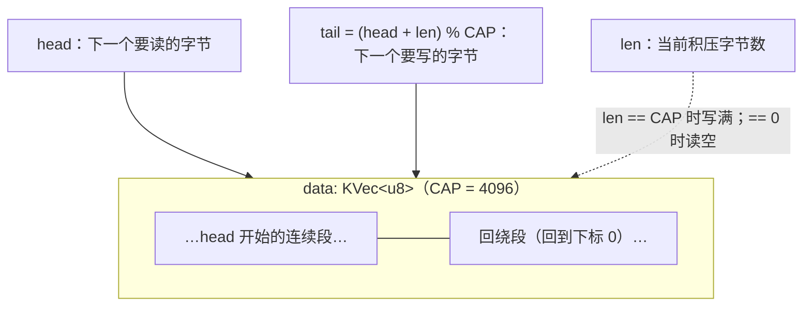

# P4：状态与并发

echo 设备每次写都推倒重来，算不上"设备"。这章把 `buffer` 换成**定容环形队列**：写只追加（满则短写）、读只消费（空则返回 0），多次读写按 FIFO 交错——一个真正的字节队列。状态升级后，"两个回调同时摸同一块内存怎么办"第一次成为真实问题，`Mutex` 从道具变成主角。

<VersionBadge label="本文锚定" kernel="master 树" date="2026-10" />

> 环形缓冲本身的算术是通用知识；与内核 API 的接口（`copy_to_iter`/`copy_from_iter` 的分段用法）对照 [`rust/kernel/iov.rs`](https://github.com/torvalds/linux/blob/master/rust/kernel/iov.rs)核实（2026-10 检索）。

## 环形缓冲：head、len 与两段拷贝

容量 `CAP = 4096` 的定容队列只需三个量：



- **写**：从 `tail` 起放 `min(请求量, 剩余空间)` 字节；放不下就是**短写**（short write），返回实际放入量
- **读**：从 `head` 起取 `min(请求量, len)` 字节；`len == 0` 返回 0（EOF 语义）
- 队列数据在 `data` 里可能断成两截（`head..CAP` 与 `0..回绕长`），所以**读写各至多两次拷贝**——这是环形缓冲的标志性代码

## 状态定义

```rust
const CAP: usize = 4096;

/// 每次 open 独立的队列状态
struct Inner {
    data: KVec<u8>,   // 定容 CAP
    head: usize,      // 下一个读位置
    len: usize,       // 积压字节数
}
```

`KVec::zeroed(CAP, GFP_KERNEL)` 一次分配好定容缓冲（`u8: Zeroable`，[第 4 章](/principles/allocation)的验证过的签名）。注意它在 `open` 里、进入初始化器**之前**构造——`?` 在普通函数里合法，初始化器宏里则没有这么直接；把可失败步骤前置是惯用法：

```rust
fn open(_file: &File, misc: &MiscDeviceRegistration<Self>) -> Result<Pin<KBox<Self>>> {
    let dev = ARef::from(misc.device());
    let data = KVec::zeroed(CAP, GFP_KERNEL)?;
    dev_info!(dev, "rustyring: 打开设备（队列容量 {}）\n", CAP);
    KBox::try_pin_init(
        try_pin_init! {
            Rustyring {
                inner <- new_mutex!(Inner { data: data, head: 0, len: 0 }),
                dev: dev,
            }
        },
        GFP_KERNEL,
    )
}
```

## 读写：分段拷贝

### read：消费

```rust
fn read_iter(kiocb: Kiocb<'_, Self::Ptr>, iov: &mut IovIterDest<'_>) -> Result<usize> {
    let me = kiocb.file();
    let mut guard = me.inner.lock();
    let want = iov.len().min(guard.len);
    if want == 0 {
        return Ok(0);                       // 队列空 = EOF
    }
    // 第一段：head 到缓冲末尾
    let first = want.min(CAP - guard.head);
    let n1 = iov.copy_to_iter(&guard.data[guard.head..guard.head + first]);
    guard.head = (guard.head + n1) % CAP;
    guard.len -= n1;
    let mut total = n1;
    // 第二段：回绕到开头
    if n1 == first && first < want {
        let second = want - first;
        let n2 = iov.copy_to_iter(&guard.data[guard.head..guard.head + second]);
        guard.head = (guard.head + n2) % CAP;
        guard.len -= n2;
        total += n2;
    }
    Ok(total)
}
```

队列语义下**文件偏移没有意义**（读的位置由队列自己管），所以 P3 里的 `ki_pos` 全部退场——`kiocb` 连 `mut` 都不需要了。注意 `guard` 直接 `&mut`：`DerefMut` 要求 `Inner: Unpin`（[第 7 章](/principles/synchronization)），而 `KVec` 与两个 `usize` 都是 `Unpin`——第 5 章那条"不可移动才需要 Pin"的界线在这里显形。

### write：生产

```rust
fn write_iter(kiocb: Kiocb<'_, Self::Ptr>, iov: &mut IovIterSource<'_>) -> Result<usize> {
    let me = kiocb.file();
    let mut guard = me.inner.lock();
    let want = iov.len().min(CAP - guard.len);
    if want == 0 {
        return Ok(0);                       // 队列满 = 短写 0 字节
    }
    let tail = (guard.head + guard.len) % CAP;
    // 第一段：tail 到缓冲末尾
    let first = want.min(CAP - tail);
    let n1 = iov.copy_from_iter(&mut guard.data[tail..tail + first]);
    guard.len += n1;
    let mut total = n1;
    // 第二段：回绕到开头
    if n1 == first && first < want {
        let second = want - first;
        let n2 = iov.copy_from_iter(&mut guard.data[..second]);
        guard.len += n2;
        total += n2;
    }
    Ok(total)
}
```

`copy_to_iter`/`copy_from_iter` 返回**实际完成的字节数**（用户缓冲区可能比声称的短），所以两段拷贝各自以返回值推进状态——不是以 `first`/`second` 满打满算。这类"以实际拷贝量记账"的写法在内核 I/O 代码里到处都是。

## 并发：为什么必须有锁

单看上面的代码，一个 fd 上的 read/write 似乎不会撞车。但内核是多任务的：

- 进程 A 正 `read` 到一半（持着 `head`/`len` 的中间状态），被抢占，进程 B 在**同一 fd**（`dup`/线程共享）上 `write` 修改了 `len`——A 回来继续用它手里的旧值推进状态，队列元数据就此损坏
- 中断上下文不会碰我们的队列（我们没有注册中断回调），但**内核抢占**与**多线程共享 fd** 在默认配置下就是现实

`Mutex<Inner>` 把整个"读三元组、算、写回"变成临界区，[第 7 章](/principles/synchronization)的教义在此落地：**持锁期间拿到的是 `Guard`，guard 的生命周期就是临界区，出不了错**。C 版环形设备要靠开发者自律的 `spin_lock`/`unlock` 配对与注释，这里由类型系统承包。

顺带一个量级直觉：临界区里只有内存拷贝与整数运算，微秒级，`Mutex`（睡眠锁）合适；若临界区要跑慢代码就该拆分或换设计——这是 C 侧同样的工程判断，Rust 不改变它，只是让"忘了加锁"从运行时炸变成编译不过。

## 验证

```bash
make LLVM=1 -j$(nproc)
```

进虚机，用同一个 fd 做三次交错读写（FIFO 的直观证明）：

```console
# insmod /lib/modules/$(uname -r)/kernel/samples/rust/rustyring.ko
# exec 3<>/dev/rustyring
# printf 'ab' >&3
# printf 'cd' >&3
# head -c 3 <&3
abc                                  ← 先进先出：读走 abc，队列剩 d
# head -c 1 <&3
d
# head -c 1 <&3
                                     ← 队列空：返回 0（EOF），head 挂起结束
```

容量边界——写入超过 `CAP` 的数据，只能留下 4096 字节：

```console
# exec 3>&-
# exec 3<>/dev/rustyring                       # 重开：干净队列
# head -c 5000 /dev/zero | tr '\0' 'x' >&3     # 想写 5000
# head -c 6000 <&3 | wc -c
4096                                 ← 满容量短写：只有前 4096 字节在队列里
```

## 排障速查

| 症状 | 方向 |
| --- | --- |
| 交错读写结果错乱 | 检查 `head` 推进是否用了实际拷贝量 `n1`/`n2`（不是 `first`/`second`） |
| 读回数据有脏字节 | `data` 必须用 `zeroed` 一次性定容；确认读的切片边界 `[head..head+n]` |
| 写 5000 只进 4096 | 这是**设计行为**（短写），不是 bug；调用方应检查返回值循环写入 |
| dmesg 出现锁相关 WARN | 检查是否在持 guard 时又调用了会加锁的函数（自死锁）——本章代码没有，改动时小心 |

## 当前完整代码

::: details samples/rust/rustyring.rs（P4 版，相对 P3 的变化已并入）
```rust
// SPDX-License-Identifier: GPL-2.0

//! rustyring：环形缓冲字符设备（实战篇成果物，随连载生长）。
//! P4：定容环形队列，FIFO 读写。

use kernel::{
    device::Device,
    fs::{File, Kiocb},
    iov::{IovIterDest, IovIterSource},
    miscdevice::{MiscDevice, MiscDeviceOptions, MiscDeviceRegistration},
    new_mutex,
    prelude::*,
    sync::{aref::ARef, Mutex},
};

module! {
    type: RustyringModule,
    name: "rustyring",
    authors: ["Rust for Linux 学习者"],
    description: "环形缓冲 misc 字符设备",
    license: "GPL",
}

const CAP: usize = 4096;

/// 每次 open 独立的队列状态
struct Inner {
    data: KVec<u8>,
    head: usize,
    len: usize,
}

#[pin_data(PinnedDrop)]
struct Rustyring {
    #[pin]
    inner: Mutex<Inner>,
    dev: ARef<Device>,
}

#[vtable]
impl MiscDevice for Rustyring {
    type Ptr = Pin<KBox<Self>>;

    fn open(_file: &File, misc: &MiscDeviceRegistration<Self>) -> Result<Pin<KBox<Self>>> {
        let dev = ARef::from(misc.device());
        let data = KVec::zeroed(CAP, GFP_KERNEL)?;
        dev_info!(dev, "rustyring: 打开设备（队列容量 {}）\n", CAP);
        KBox::try_pin_init(
            try_pin_init! {
                Rustyring {
                    inner <- new_mutex!(Inner { data: data, head: 0, len: 0 }),
                    dev: dev,
                }
            },
            GFP_KERNEL,
        )
    }

    fn read_iter(kiocb: Kiocb<'_, Self::Ptr>, iov: &mut IovIterDest<'_>) -> Result<usize> {
        let me = kiocb.file();
        let mut guard = me.inner.lock();
        let want = iov.len().min(guard.len);
        if want == 0 {
            return Ok(0);
        }
        let first = want.min(CAP - guard.head);
        let n1 = iov.copy_to_iter(&guard.data[guard.head..guard.head + first]);
        guard.head = (guard.head + n1) % CAP;
        guard.len -= n1;
        let mut total = n1;
        if n1 == first && first < want {
            let second = want - first;
            let n2 = iov.copy_to_iter(&guard.data[guard.head..guard.head + second]);
            guard.head = (guard.head + n2) % CAP;
            guard.len -= n2;
            total += n2;
        }
        Ok(total)
    }

    fn write_iter(kiocb: Kiocb<'_, Self::Ptr>, iov: &mut IovIterSource<'_>) -> Result<usize> {
        let me = kiocb.file();
        let mut guard = me.inner.lock();
        let want = iov.len().min(CAP - guard.len);
        if want == 0 {
            return Ok(0);
        }
        let tail = (guard.head + guard.len) % CAP;
        let first = want.min(CAP - tail);
        let n1 = iov.copy_from_iter(&mut guard.data[tail..tail + first]);
        guard.len += n1;
        let mut total = n1;
        if n1 == first && first < want {
            let second = want - first;
            let n2 = iov.copy_from_iter(&mut guard.data[..second]);
            guard.len += n2;
            total += n2;
        }
        Ok(total)
    }
}

#[pinned_drop]
impl PinnedDrop for Rustyring {
    fn drop(self: Pin<&mut Self>) {
        dev_info!(self.dev, "rustyring: 设备状态销毁\n");
    }
}

#[pin_data]
struct RustyringModule {
    #[pin]
    _miscdev: MiscDeviceRegistration<Rustyring>,
}

impl kernel::InPlaceModule for RustyringModule {
    fn init(_module: &'static ThisModule) -> impl PinInit<Self, Error> {
        pr_info!("rustyring: 注册 misc 设备\n");
        let options = MiscDeviceOptions { name: c"rustyring" };
        try_pin_init!(Self {
            _miscdev <- MiscDeviceRegistration::register(options),
        })
    }
}
```
:::

队列有了，还差最后一块拼图：不经过 read/write 的控制通道。[P5：ioctl 与用户内存](/practice/ioctl-uaccess)给 rustyring 加上"查询积压量"和"清空"两个命令。
