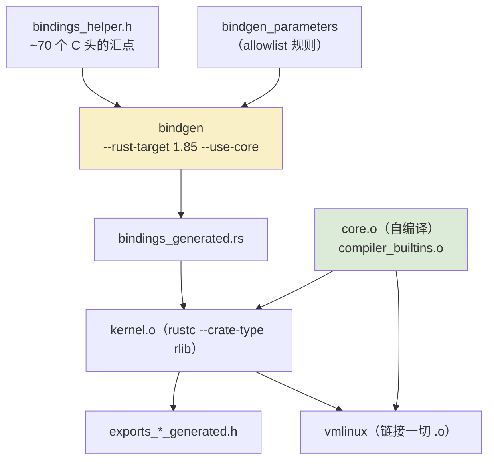
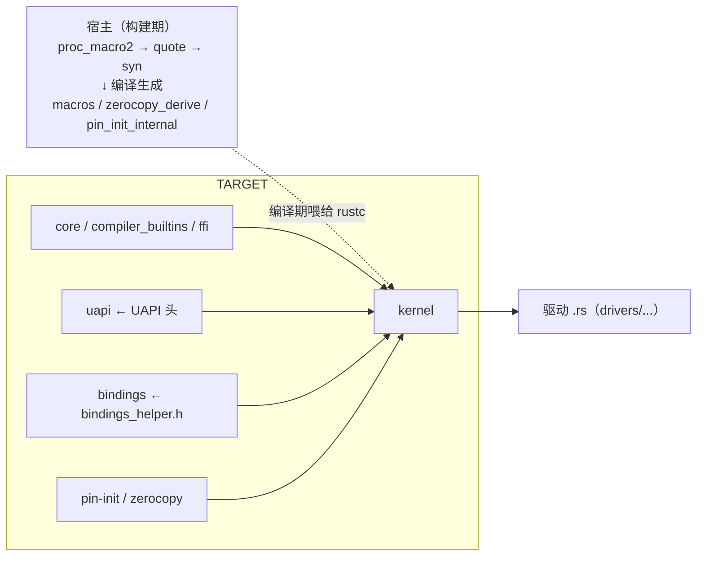

# 构建系统：Kbuild 与 bindgen

最后一章回答一个从头悬到现在的问题：`rust/` 目录下这些 crate，是怎么被一个 30 年历史的 C 构建系统消化成内核镜像的？答案是三个生成器的接力——bindgen 生成 C 绑定、rustc 直接编译 `core`、Kbuild 把 rustc 产物当作另一种 `.o` 对待。看懂这一章，内核 Rust 就从"魔法"变成"工程"。

<VersionBadge label="本文锚定" kernel="master 树" rustc="1.85 (bindgen 目标)" date="2026-10" />

> 事实来源：[`rust/Makefile`](https://github.com/torvalds/linux/blob/master/rust/Makefile)与 [`rust/bindings/bindings_helper.h`](https://github.com/torvalds/linux/blob/master/rust/bindings/bindings_helper.h)（2026-10 检索），引用处为原文。

## .rs 如何变成内核产物

`rust/Makefile` 列出 `CONFIG_RUST=y` 时构建的全部对象：

```
core.o  compiler_builtins.o  ffi.o  zerocopy.o
bindings.o  pin_init.o  kernel.o  uapi.o
build_error.o  exports.o  helpers/helpers.o
```

每一行都是一个"反常识"：

- **`core.o` 由内核自己编译**。不是 `-Zbuild-std`，而是直接从工具链源码（`RUST_LIB_SRC`，即 rustup 的 `rust-src` 组件）编译 `core`，带内核定制 cfg（如 `no_fp_fmt_parse`）；`compiler_builtins.o` 单独构建，其符号还会被 `rustc_objcopy --redefine-sym` 重命名以避开 C 侧同名。快速上手章要求装 `rust-src` 的原因就在这。
- **没有 std**。rustc 以 `--sysroot=/dev/null` 被强制与默认 sysroot 断绝关系，链接世界只剩 `core` 与内核自身（`ffi` crate 提供 `c_int` 等 C 类型定义）。
- **`helpers/` 是反方向的桥**。C 函数写给 Rust 调用：helpers 的绑定生成用 `--blocklist-type '.*' --allowlist-function 'rust_helper_.*'` 只放行约定命名的 C 辅助函数。
- **宿主与目标两套世界**。`macros`（过程宏）、`zerocopy_derive`、`pin_init_internal` 是构建期在宿主机跑的 proc-macro，为此 Kbuild 先编译 `proc_macro2`/`quote`/`syn` 的宿主 rlib——而宿主 Rust 标志带 `-Zallow-features=` 空白名单（第六章），宿主代码零 unstable。
- **`exports.o` 是给 C 的礼物**：把 Rust 符号生成 `exports_*_generated.h`，让 C 代码也能 `EXPORT_SYMBOL_GPL` 式地引用 Rust 侧导出。

构建管线全景：



## bindgen 的工作方式

主入口是 `rust/bindings/bindings_helper.h`——它的全部内容就是"要生成绑定的头的清单"。真实调用（`rust/Makefile`）：

```make
$(BINDGEN) $< $(bindgen_target_flags) --rust-target 1.85 \
    --use-core --with-derive-default --ctypes-prefix ffi \
    --no-layout-tests --no-debug '.*' \
    --enable-function-attribute-detection \
    -o $@ -- $(bindgen_c_flags_final) -DMODULE
```

四个关键决策：

1. **`--rust-target 1.85`**：绑定的最低 Rust 版本锚点，第四章速查表里 Ubuntu 用 `rustc-1.85` 的出处。
2. **`--use-core`**：生成代码只依赖 `core`——没有 std 的世界里别无选择。
3. **allowlist 分两层**：主绑定经 `bindgen_parameters` 文件配置（每行一条规则）；helpers 绑定用命令行显式 allowlist（前述 `rust_helper_.*`）。**默认不进清单的符号不存在**——这是控制 API 暴露面的第一道闸门，也解释了第二章"bindings 是公开但危险"的精确含义：公开的是生成结果，入口由构建系统收窄。
4. **`bindings_helper.h` 本身是活的工程文档**。它顶部的 `hrtimer_types.h` 是为绕过 bindgen #3179（头文件包含顺序影响枚举类型推断）；中间有 `RUST_CONST_HELPER_*` 常量块——`PAGE_SIZE`、`GFP_*`、`VM_*` 这些**宏**bindgen 看不见，得手写成 C 常量再生成（第四章的 GFP 常量正源于此）；末尾按 CONFIG 条件包含（如 `CONFIG_ANDROID_BINDER_IPC` 时的 binder 头）；甚至有一条 `../../drivers/base/base.h`——驱动核心的**私有**结构，为了让 Rust 侧 device 抽象能工作而开的直通道。

## crate 依赖图（最终版）

把第二章的图补全到构建视角：



rustc 编译 `kernel.o` 时的 `--extern` 清单（`rust/Makefile` 原文）即这条边集：`--extern ffi --extern pin_init --extern build_error --extern macros --extern bindings --extern uapi --extern zerocopy --extern zerocopy_derive`。符号 mangling 统一为 v0（`-Csymbol-mangling-version=v0`），保证 Rust 符号在链接器与崩溃栈回溯里可读。

## C ↔ Rust 符号桥接

双向各有正道：

- **Rust 调 C**：`bindings::` 里的声明（bindgen 产物）+ `extern "C"`。`kernel` crate 内每次调用配 SAFETY 注释（第一章）。
- **C 调 Rust**：`exports.o` 生成的导出头 + `#[export]` 宏（`macros` crate 提供）。C 侧看到的仍是普通内核符号，`EXPORT_SYMBOL_GPL` 语义保留——**Rust 代码进内核不改许可证游戏规则**，这也是合入的政治前提之一。
- **能力探测**：Kconfig 直接问 rustc——`CONFIG_RUSTC_HAS_FILE_WITH_NUL` 这类选项按 `RUSTC_VERSION >= NNNN` 生成（`Documentation/rust/general-information.rst` 给的标准手法），第六章的 `cfg_attr` 特性开关由此驱动。

## 小结

- 三个生成器接力：bindgen 出绑定、内核自编译 `core`（故需 `rust-src`）、Kbuild 把 rlib 当 `.o`
- bindings_helper.h 是活的文档：workaround、宏常量、条件包含、私有头直通道，尽在其中
- allowlist 默认拒绝；宿主构建零 unstable；符号 mangling v0；导出遵 GPL 规则
- 构建系统把第二章的分层图从"逻辑架构"落成"物理现实"——教程正文至此闭环

原理篇完了。[展望与学习路线](/outlook/future)聊聊接下来去哪儿，或者直接翻[附录：C↔Rust 映射速查表](/appendix/c-rust-mapping)当工具用。
