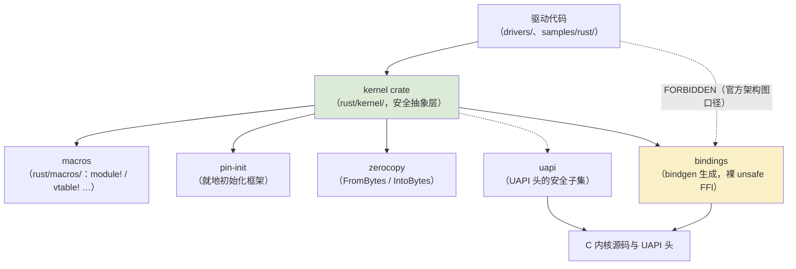

# kernel crate 结构图谱

上一章讲了安全抽象的分层哲学；这一章把中间那层——`kernel` crate——摊开来看：它内部如何组织、哪些类型是通用工具箱、以及作为读者如何按图索骥。**学会读这层源码，比记住任何具体 API 都重要**，因为它是滚动的：模块在增加、类型在搬家，而结构是稳定的。

<VersionBadge label="本文锚定" kernel="master 树" date="2026-10" />

> 模块清单对照 [torvalds/linux master 的 `rust/kernel/lib.rs`](https://github.com/torvalds/linux/blob/master/rust/kernel/lib.rs)核实（2026-10 检索）。

## rust/kernel/ 目录地图

`lib.rs` 目前声明了约 70 个模块。按用途分组看一眼（不求全，求建立索引感）：

| 分组 | 代表模块 |
| --- | --- |
| 语言与基础 | `error`、`alloc`、`str`、`fmt`、`print`、`types`、`ptr`、`init`、`build_assert`、`bug`、`transmute`、`safety` |
| 同步与执行 | `sync`、`workqueue`、`irq`、`interrupt`、`task`、`cpu`、`time` |
| 数据结构 | `list`、`rbtree`、`maple_tree`、`xarray`、`bitmap`、`id_pool`、`iov`、`scatterlist` |
| 内存 | `mm`、`page`、`dma`、`iommu`、`io`、`uaccess` |
| 设备与驱动模型 | `device`、`driver`、`platform`、`miscdevice`、`devres`、`of`、`acpi`、`clk`、`regulator`、`ioctl`、`device_id` |
| 进程与安全 | `cred`、`security`、`pid_namespace`、`seq_file`、`debugfs`、`fs` |

另一批模块带 `#[cfg(...)]` 门控，只有对应子系统启用时才编译——这是"抽象按子系统渐进合入"策略的直接体现：

```rust
// lib.rs 中（节选）
#[cfg(CONFIG_NET)]
pub mod net;
#[cfg(CONFIG_DRM = "y")]
pub mod drm;
#[cfg(CONFIG_PCI)]
pub mod pci;
#[cfg(CONFIG_RUST_PWM_ABSTRACTIONS)]
pub mod pwm;
#[cfg(CONFIG_RUST_SERIAL_DEV_BUS_ABSTRACTIONS)]
pub mod serdev;
```

注意两类门控的差别：`CONFIG_PCI` 跟随子系统本身；而 `CONFIG_RUST_PWM_ABSTRACTIONS` 这类 `RUST_*_ABSTRACTIONS` 选项则是**专门为 Rust 抽象层设的开关**——子系统维护者对是否接纳 Rust 抽象拥有否决权，这正是引子里那场"文化战争"在代码里的投影。

### crate 级视图

`kernel` 不是孤岛。整个 Rust 支持由几个 crate 组成：



- **bindings**：bindgen 从 C 头文件机械生成的声明，全 unsafe，无人手写。它在图上用黄色标出——**这是唯一"危险"的 crate**，正常开发不应该直接碰它。
- **uapi**：用户/内核共享的 UAPI 头的 Rust 侧镜像，只含纯数据布局，不涉函数。
- **macros**：`#[module]`（原 `module!`）、`#[vtable]` 等过程宏，让样板代码（模块元信息、ops 表默认值）声明式书写。
- **pin-init / zerocopy**：以独立 crate 形式引入的支撑件。`prelude` 里 `pub use` 了它们的核心 trait（`PinInit`、`Init`、`FromBytes`……），说明其地位已是"内核 Rust 语言的一部分"——第六章会专门讲 pin-init。

`prelude`（`rust/kernel/prelude.rs`）是这套体系的公共入口：`use kernel::prelude::*;` 一行即可获得 `Result`/`Error`/`code::*`、`KBox`/`KVec` 家族、`pr_*`/`dev_*` 日志宏、`pin_init` 家族与 `ThisModule` 等最常用项。

## 关键类型工具箱

上一章解剖过 `ARef` 与 `Opaque` 的设计。这里补全工具箱的其余成员，并给出**今天**它们各自的住所——注意"搬家"是常态：`ARef` 与 `AlwaysRefCounted` 在较早的内核版本里位于 `types.rs`，如今已在 `sync/aref.rs`。这正是本教程坚持版本锚定的原因。

- **`ScopeGuard<T, F: FnOnce(T)>`**（`types.rs`）——通用 RAII 清理守卫：构造时绑定一个值和清理函数，作用域结束（或手动 `dismiss`）时执行。用于尚无专用封装类型的临时资源。
- **`ForeignOwnable`**（`types.rs`）——把 Rust 所有权对象"借给"C 世界的协议：`into_foreign()` 变裸指针交出去，`from_foreign()` 收回来恢复所有权，中间 C 只能当不透明字节用。C 回调持有 Rust 数据的场景全靠它。
- **`Opaque<T>`**（`types.rs`）——方向相反：承载 C 侧数据（可能未初始化、被 C 并发修改、不可移动），上一章已详解。
- **`NotThreadSafe`**（`types.rs`）——`PhantomData<*mut ()>` 的别名，`!Send`/`!Sync` 的惯用标记物（裸指针两者皆非）。
- **`ptr` 模块**——指针算术的安全化：`Alignment`（二的幂新类型）、`Alignable`、`KnownSize`，以及 `projection` 子模块——**字段投影**，第六章的主角之一。
- **`ForLt` / `CovariantForLt`**（`types/for_lt.rs`）——用于表达"对生命周期参数的协变"的高阶技巧，日常写驱动用不到，读抽象层源码时会遇到。

还有一个值得单独点名的模式：**newtype 包裹裸整数/裸指针**。`Alignment(NonZero<usize>)` 是典型——不变量（二的幂、非零）直接由类型刻画，非法状态无法构造。你在各模块里会反复看到这个手法的变体。

## 结构图谱与 bindings 的关系

回看上面的 crate 图，`kernel` → `bindings` 是唯一的下行箭头，这个方向的含义值得强调：

- `bindings` 的生成由构建系统控制（allowlist 决定哪些头文件、哪些符号进入），第十一章讲 Kbuild 时会展开；
- `kernel` crate 里对 bindings 的每一次调用都裹在 unsafe 中并配 SAFETY 注释——上一章的分纪律在这里落实为代码密度；
- 驱动代码与 `bindings` 之间只有虚线，这不是省略：官方文档（`Documentation/rust/general-information.rst`）的架构图把驱动直连 C 标为 **FORBIDDEN**。`kernel::bindings` 虽是公开 crate，但绕过抽象层直连需要极其充分的理由并自负 unsafe——遇到抽象缺口，正解是给抽象层提 patch。

这套结构也解释了评审责任的划分：`bindings` 由工具保证正确性；`kernel` crate 的每处 unsafe 由 Rust-for-Linux 维护者与相关子系统维护者共同把关；驱动代码则回归普通 Rust 的评审强度。

## 如何读源码

推荐的阅读路线（每一步都小到一次通勤能读完）：

1. **`rust/kernel/error.rs`**——最小、自包含、无unsafe 深水区，顺便修下一章的主题。
2. **`rust/kernel/types.rs`**——工具箱核心，`Opaque`/`ScopeGuard`/`ForeignOwnable` 都在此。
3. **`rust/kernel/sync/`**——`lock.rs`（第七章）、`aref.rs`、`arc.rs`，体会 guard 模式的两种应用。
4. **`rust/kernel/device.rs` + `rust/kernel/driver.rs`**——设备模型与驱动注册框架（第九章预备）。
5. **一个真实驱动**——在 `drivers/` 下全局搜索 `use kernel::` 挑一个短的读，或直接读 `samples/rust/` 全家。

浏览工具：[GitHub 的 torvalds/linux](https://github.com/torvalds/linux/tree/master/rust)或 [elixir.bootlin.com](https://elixir.bootlin.com/linux/latest/source/rust)（支持跳转与引用检索）。读的时候记住本章的地图，迷路了就回来对一眼分组表。

## 小结

- `kernel` crate ≈ 70 个模块：语言基础、同步、数据结构、内存、设备模型、子系统门控件
- crate 级结构：驱动 → kernel → bindings（危险区）→ C；macros/pin-init/zerocopy 是支撑 crate
- 工具箱成员各有住所，且会搬家——用版本锚定对抗漂移
- 阅读路线：error → types → sync → device/driver → 真实驱动

工具箱里第一个要深入的成员就是 `error.rs`——它最小，却定义了 C 与 Rust 两个世界之间的错误语义。下一章：[错误处理：Result 与 errno](/principles/error-handling)。
