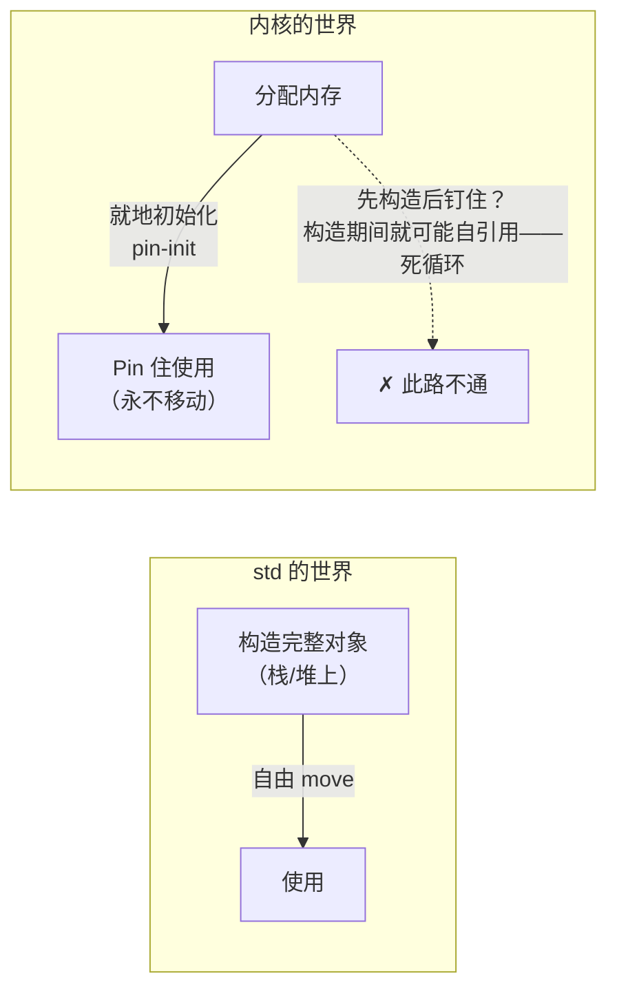

# Pinning 与就地初始化

Rust 的默认世界观里，值是可以随意移动的：赋值、传参、放进 `Vec` 都只是把字节搬到新地址。内核的世界观恰好相反：**大量内核对象的地址一旦确定就不能再变**。这两种世界观碰撞出内核 Rust 最深的一层设计——本章是全教程难度的高点，也值得：读懂它，`sync`、设备模型、真实驱动的源码就全部畅通。

<VersionBadge label="本文锚定" kernel="master 树" date="2026-10" />

> API 事实对照 [torvalds/linux master 的 `rust/kernel/init.rs`](https://github.com/torvalds/linux/blob/master/rust/kernel/init.rs)与 `sync/lock.rs`、`types.rs` 核实（2026-10 检索）。

## 内核对象为什么不能移动

哪些内核对象不可移动？比直觉的多：

- **自引用**：很多 C 结构体内含指向自身内部的指针（内嵌的链表节点、定时器的回调数据）。移动后这些内部指针指向旧地址——搬一次，全断。
- **被外部登记**：对象把 `&self` 的某部分注册进了全局表（workqueue、中断、驱动核心的 drvdata）。C 侧持有裸指针，Rust 毫不知情地 move 一下，C 手里的指针就成了悬垂。
- **C 锁与内核基础设施**：`spinlock_t` 等对象在部分架构上含自引用，`rust/kernel/sync/lock.rs` 里 `Lock` 结构体的注释直言加 `PhantomPinned` 是保守做法——"some arches may self-reference"。

第三章的 `Opaque` 已经预告过这一点：`Opaque<T>` 里那个 `_pin: PhantomPinned` 字段，就是在类型层面宣告"我不可移动"。`PhantomPinned` 通过让 `T: !Unpin` 自动阻止安全代码获取 `&mut T` 后用 `mem::replace`/move 搬走它。

## Pin 入门

标准库的答案分两层：

- `Pin<P>` 是一个指针包装，它**承诺不移动**被指对象（对 `!Unpin` 类型而言）。
- `Unpin` 是"其实可以随便动"的标记 trait：绝大多数普通类型（`i32`、`String`……）自动实现 `Unpin`，`Pin` 对它们形同虚设；含 `PhantomPinned` 的类型则是 `!Unpin`，想安全地使用它们就必须经过 `Pin` 的规程。

内核侧读者需要记住的推论只有一条，但它极其深远：**拿到 `Pin<&mut T>`（而不是 `&mut T>`）才能调用需要可变性的方法，而这个能力只能由"拥有钉住责任的指针"逐步传递**。第七章会看到一个直接后果：锁 guard 的 `DerefMut` 要求 `T: Unpin`——保护的数据若不可移动，持锁期间也不允许你拿到会移动它的可变引用。



## #[pin_data] 与 pin-init API

std 的初始化模型是"先完整构造值，再用它"——构造期间不存在半成品。但"构造完整对象"本身要求把对象搬到最终位置（从栈到堆，或塞进容器），这与不可移动矛盾：**构造到一半的对象可能已经持有了指向自己的指针**。"先构造后钉住"因此逻辑上不成立，必须反过来：**先分配最终位置，再就地初始化**。

`pin-init` 框架（内核树内的独立 crate，经 `kernel` crate 的 `init` 模块再导出）就是这套"反向构造"的语言化。使用面三个入口：

**1. `#[pin_data]` 标注结构体**——声明哪些字段钉住、哪些可以自由动：

```rust
#[pin_data]
pub struct Lock<T: ?Sized, B: Backend> {
    #[pin]
    state: Opaque<B::State>,      // C 锁对象：钉住
    #[pin]
    _pin: PhantomPinned,
    pub(crate) data: UnsafeCell<T>,  // 普通数据：不钉
}
```

（真实的 `sync/lock.rs` 声明，仅省略了派生属性。）

**2. `pin_init!` / `try_pin_init!` 描述初始化过程**——不是执行构造，而是生成一个"初始化器"值，它携带构造逻辑、等待被写到目标内存：

```rust
impl<T, B: Backend> Lock<T, B> {
    pub fn new(
        t: impl PinInit<T>,
        name: &'static CStr,
        key: Pin<&'static LockClassKey>,
    ) -> impl PinInit<Self>
    //          ^^^^^^^^^^^^^^^^^ 返回的不是 Self，是"如何构造 Self 的方案"
    {
        pin_init!(Self {
            data: t,
            _pin: PhantomPinned,
            state <- Opaque::ffi_init(|ptr| B::init(ptr, name, key)),
            //     ^ `<-` 语法：这个字段不是"给值"，而是"就地跑一段初始化"
        })
    }
}
```

注意 `state <-` 箭头语法：C 锁对象没法在 Rust 侧"算出一个值来"，只能把地址递给 C 的初始化函数（`B::init` 底下就是 `spin_lock_init` 那一族）。`Opaque::ffi_init` 正是为"初始化就是一次 FFI 调用"的场景准备的捷径——`init.rs` 模块文档专门说明了这个分工。

**3. `InPlaceInit` 把初始化器写进目标内存**——`KBox`/`Arc` 等智能指针实现该 trait，提供落点：

```rust
pub trait InPlaceInit<T>: Sized {
    type PinnedSelf;

    fn try_pin_init<E>(init: impl PinInit<T, E>, flags: Flags)
        -> Result<Self::PinnedSelf, E>
    where E: From<AllocError>;

    fn pin_init<E>(init: impl PinInit<T, E>, flags: Flags)
        -> error::Result<Self::PinnedSelf>
    where Error: From<E>;
    // 另有 try_init/init：可移动类型用这对
}
```

于是内核代码里最常见的构造形态是：

```rust
let lock = KBox::pin_init(
    try_pin_init!(SpinLock::new(data, name, static_lock_class!())?),
    GFP_KERNEL,
)?;
// lock: KBox<Pin<SpinLock<T>>> —— 分配、初始化、钉住一次完成
```

分配（第四章的 `GFP_KERNEL`）、就地初始化、pinning 在同一条语句里合流——第四、五章在此闭环。而 `try_pin_init!` 本身只是给 `::pin_init::pin_init!` 加上默认错误类型 `Error` 的薄封装（`init.rs` 中可见），错误在初始化器内部照常用 `?` 传播。

## Opaque 与未初始化内存

就地初始化的前提是敢于持有"尚未成为 T 的内存"。这就是 `Opaque<T>` 的第三重身份（前两重见第一、四章）：

```rust
#[repr(transparent)]
pub struct Opaque<T> {
    value: UnsafeCell<MaybeUninit<T>>,
    _pin: PhantomPinned,
}
```

`MaybeUninit<T>` 使"未初始化"成为合法类型状态——你可以先 `Opaque::uninit()` 占位，稍后经 `ffi_init` 让 C 填充，填好之前类型系统阻止你把它当 `T` 用（`get()` 返回裸指针，取值的责任在抽象层）。初始化器框架与它咬合：`state <- Opaque::ffi_init(...)` 写下的正是"这块未初始化内存何时、被谁、怎样合法化"的合同。

## 为什么这是内核 Rust 最硬核的部分

三个原因叠加：

1. **与 std 模型方向相反**。std 先有值再谈位置；内核先有位置再谈值。使用者要扭转的直觉不是语法，是构造的世界观。
2. **语言缺口仍在补**。今天的 `pin-init!` 宏本质是在宏层面模拟"字段逐个就地初始化"的语言能力。更优雅的形态——字段投影（field projection，对 `Pin<&T>` 安全地取 `Pin<&Field>`）——正是 `rust/kernel/ptr/` 下 `projection` 模块与上游 `arbitrary_self_types` 等 unstable 特性要解决的问题（下一章展开）。宏是过渡态，语言级方案是终态，读者要有"今天学的 API 形态会演进"的心理预期。
3. **它是所有基础设施的地基**。`Lock::new` 返回 `impl PinInit`、第八章 `Driver::probe` 返回 `impl PinInit<Data>`、`Arc` 的构造同样走 pin-init——驱动作者写每一行 probe 都在和这个模型打交道，躲不开。

好在使用面收口很小：认得 `#[pin_data]`、会用 `pin_init!`/`try_pin_init!`、知道 `<-` 表示"就地跑初始化"，就足以读懂和写出绝大多数代码。深水区留给抽象层维护者。

## 小结

- 内核对象因自引用、外部登记、C 基础设施而 `!Unpin`；`PhantomPinned` 是类型层宣言
- "先构造后钉住"逻辑上不成立，pin-init 把构造反转成"初始化器"：`#[pin_data]` 声明结构、`pin_init!` 描述过程、`InPlaceInit` 提供落点
- `Opaque` 的 `MaybeUninit` 让未初始化内存成为可表述的合法状态
- 字段投影是这套设计的语言级未来，也是 unstable 特性清单的常客

构造的世界观之后，看它最经典的应用场景：锁。[下一章：同步原语的 RAII 封装](/principles/synchronization)。
