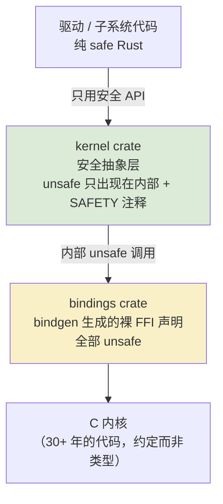

# 安全抽象的哲学

<KernelTerm en="safety abstraction">安全抽象</KernelTerm>是整个 Rust for Linux 项目的核心概念：**用一层薄薄的、经过严格评审的 Rust 封装，把 C 内核的不安全世界变成安全 API，让上层驱动代码写不出内存安全 bug。** 这一章讲清楚它的设计哲学——后面所有章节（错误处理、pinning、同步、设备模型）都是这个哲学在具体问题上的展开。

<VersionBadge label="本文锚定" kernel="master 树" date="2026-10" />

> 本文 API 事实对照 [torvalds/linux master 树](https://github.com/torvalds/linux/tree/master/rust/kernel)核实（2026-10 检索）。内核 Rust API 演进很快，阅读时请以你手上源码树为准。

## unsafe 是边界，不是罪名

在应用层 Rust 里，`unsafe` 常被当作"危险的逃生舱"，最好一处不写。在内核里，`unsafe` 的角色完全不同——它是**标记安全边界的形式语言**。内核代码里的 `unsafe` 大致出现在三种角色上：

1. **绑定层（bindings）**：bindgen 从 C 头文件生成的 `extern "C"` 声明。调用任何 C 函数本质上都是 unsafe 的——编译器对 C 代码的行为一无所知，调用者必须自己保证前置条件。
2. **抽象层内部**：`kernel` crate 的实现代码。这是 unsafe 最集中的地方，但每处 unsafe 都不是"图省事"，而是在**实现一个安全 API 的内部机制**。
3. **驱动中的显式豁免**：驱动代码里原则上不应该出现 unsafe。出现了，就说明抽象层缺了一块——要么补抽象，要么给出一段无法类型化的特殊理由。

支撑这套纪律的是一条硬性编码规范：**每处 unsafe 操作必须伴随 `// SAFETY:` 注释，说明为什么此处满足安全前提**。这不是文档点缀，而是评审时逐条检查的合同。内核编码规范（Documentation/rust/coding-guidelines）明确要求这一点。

理解 `unsafe` 的关键转向是：`unsafe fn` 的意思是"**调用者必须维护某些前置条件**"，它是一份写下来的契约，不是 bug 标记。安全抽象的工作，就是把契约从"每个调用点人工核对"变成"类型系统自动核对"。

## "安全 API 包裹健全的 unsafe 内部"

这句话里有个比 unsafe 更重要的词：<KernelTerm en="soundness">健全性</KernelTerm>——**无论外部以何种方式（组合、泛型、并发）使用你的安全 API，都不会触发未定义行为**。一个安全 API 只有在其内部 unsafe 全部满足契约、且 API 表面没有泄漏出破坏不变量的途径时，才是健全的。

内核 Rust 代码因此形成严格的分层：



注意箭头方向蕴含的规则：**驱动代码不直接调用 bindings**。越往下越危险、越需要专家评审；越往上越安全、越可以放心大胆地写。这个分层不是建议而是架构——后面会看到，评审责任也按这个分层划分。

一个"一行代码的安全抽象"实例，来自 `rust/kernel/error.rs`：

```rust
// 将内核 ERR_PTR 惯用法（用指针值编码错误）转成 Result
pub fn from_err_ptr<T>(ptr: *mut T) -> Result<*mut T>
```

C 世界里"`ERR_PTR` 表示失败、`NULL` 有时也算成功"的口头约定，被这个函数收编为一个不可能误用的类型。它内部当然有 unsafe（读取指针值、比较区间），但外部看到的是普通的 `Result`。

## 把不变量编码进类型

安全抽象最有效的手法，是**把"使用规则"变成"类型系统的物理约束"**。看一个真实例子：内核的引用计数对象。

C 世界里，`struct device` 的生命周期由 `get_device()`/`put_device()` 手工配对管理。所有使用规则都存在于文档与评审中：

```c
struct device *d = dev_get();      // 失败时返回 ERR_PTR
if (IS_ERR(d))
    return PTR_ERR(d);

use(d);
dev_put(d);                        // 忘记调用 → 泄漏
                                   // 多次调用 / put 后继续用 → use-after-free
```

而在 master 树的 `rust/kernel/sync/aref.rs` 中，同样的生命周期变成了类型：

```rust
pub unsafe trait AlwaysRefCounted {
    fn inc_ref(&self);
    unsafe fn dec_ref(obj: NonNull<Self>);
}

pub struct ARef<T: AlwaysRefCounted> {
    ptr: NonNull<T>,
    _p: PhantomData<T>,
}

impl<T: AlwaysRefCounted> From<&T> for ARef<T> {
    fn from(b: &T) -> Self {
        b.inc_ref();
        // SAFETY: We just incremented the refcount above.
        unsafe { Self::from_raw(NonNull::from(b)) }
    }
}

impl<T: AlwaysRefCounted> Drop for ARef<T> {
    fn drop(&mut self) {
        // SAFETY: The type invariants guarantee that the `ARef`
        // owns the reference we're about to decrement.
        unsafe { T::dec_ref(self.ptr) };
    }
}
```

读一遍这段代码的三处设计：

- **`From<&T> for ARef<T>`**：从引用获得 `ARef` 时自动 `inc_ref`。你无法"忘记"加计数——不存在不经过这条路径的构造方法。
- **`Drop`**：`ARef` 离开作用域自动 `dec_ref`。你无法"忘记"减计数——泄漏在类型层面不可能发生。
- **`NonNull<T>` + PhantomData**：指针永不为 null（`Option<ARef<T>>` 免费获得空指针优化），且发送/共享属性由 `T` 决定。

于是 `Device::get_device()` 的签名直接写成 `fn get_device() -> ARef<Self>`——返回值本身就携带所有权语义。至于 `AlwaysRefCounted` 的 `unsafe impl`（在 `rust/kernel/device.rs` 中，`inc_ref` 包着 `bindings::get_device`，`dec_ref` 包着 `bindings::put_device`），那是抽象层内部用一条 SAFETY 注释一次性背书的地方。**危险被集中到一处，由专家评审一次；安全则被分发到每一处使用点，免费获得。**

另一个"不变量进类型"的基础工具是 `Opaque<T>`（`rust/kernel/types.rs`）：

```rust
#[repr(transparent)]
pub struct Opaque<T> {
    value: UnsafeCell<MaybeUninit<T>>,
    _pin: PhantomPinned,
}
```

一行类型声明压进了三条不变量：`UnsafeCell` 允许 C 侧不受 Rust 别名规则约束地读写这块内存；`MaybeUninit` 承认"这块内存还没有初始化"是合法状态（内核对象经常由 C 先分配、后填充）；`PhantomPinned` 则宣告它一旦地址确定就不可移动（第六章会展开为什么）。`repr(transparent)` 保证它在 ABI 上就是一个裸 `T`，可以和 C 无缝互操作。

## 为什么"裸 unsafe 驱动"不是目标

一个自然的疑问：既然 unsafe Rust 能做一切，驱动直接全程 unsafe 不就行了？

不行，而且这正是项目立项时就想清楚的问题：**全程 unsafe 的 Rust 驱动约等于一门语法更啰嗦的 C**——内存安全的全部收益归零，工具链与社区成本却照付。Rust 进内核的唯一理由就是让驱动作者"写不出"某类 bug；如果放弃了安全层，就没有任何理由放弃 C。

还有一层维护性论证：驱动数量成千上万，作者水平参差；抽象层数量有限，由少数专家编写、经最严格的评审。把不变量的核对从"每个驱动的每一行"收敛到"抽象层的每个 SAFETY 注释"，是把有限的高质量评审注意力投放到杠杆最大的位置。这也是社区争论的焦点所在——抽象层该由谁维护、C 子系统维护者是否有义务配合，本质上都是在谈这个责任的分界线（引子页提过的"文化战争"正是因此而起）。

## 一个完整的微型例子

最后用一个（简化的教学）例子把哲学落地。假设有这样一个 C 接口：

```c
// C 接口：启动一个定时器，返回 0 或负 errno
int timer_arm(struct my_timer *t, unsigned int ms);
// 停止定时器。停止后继续使用 t 是未定义行为
void timer_disarm(struct my_timer *t);
```

C 里最容易写出的 bug：

```c
timer_disarm(t);
timer_arm(t, 100);   // 编译通过，运行时未定义行为
```

Rust 安全封装的第一直觉可能还是提供两个方法——但那只是把 C API 翻译了一遍，误用依然可能。安全抽象的做法是让"误用"无法通过编译：

```rust
pub struct Timer {
    raw: Opaque<bindings::my_timer>,
}

impl Timer {
    pub fn arm(&self, ms: u32) -> Result {
        // SAFETY: `self.raw` 由本类型独占初始化，指针有效。
        to_result(unsafe { bindings::timer_arm(self.raw.get(), ms) })
    }

    /// 消耗 `self` 来停止定时器——之后没有任何值可以再被使用。
    pub fn disarm(self) {
        // SAFETY: `self` 被 move 进来，此后不存在别名。
        unsafe { bindings::timer_disarm(self.raw.get()) };
    }
}
```

注意 `disarm` 的签名：它**按值获取 `self`**。于是之前的 bug 变成：

```rust
let t = Timer::new()?;
t.arm(100)?;
t.disarm();
t.arm(200);
//          ^^^ 编译错误：t 已被移动（E0382）
```

C 里"停止后继续使用是 UB"这句文档，在 Rust 里变成编译器错误。这就是安全抽象的全部要义：**不是消除危险操作，而是让危险操作的误用从运行时搬到编译期。**

::: tip 关于例子的简化
真实内核里 `Timer` 的 Drop 与 `disarm` 会重复释放，需要用 `ManuallyDrop` 或状态标志处理——那正是第六章 pinning 与就地初始化要解决的问题。此处省略，专注主干。
:::

## 小结

- `unsafe` 是安全边界的标记语言；内核强制每处 unsafe 配 SAFETY 注释
- 安全抽象 = 健全的安全 API + 内部受控的 unsafe；分层为 bindings → kernel crate → 驱动
- 核心手法是把使用规则编码进类型（`ARef` 的所有权、`Opaque` 的 FFI 内存语义）
- 裸 unsafe 驱动没有意义；安全层是全部价值所在，也是评审责任的分界线

下一章我们拿出地图：[kernel crate 结构图谱](/principles/kernel-crate)——这个安全抽象层内部长什么样、怎么按图索骥。
